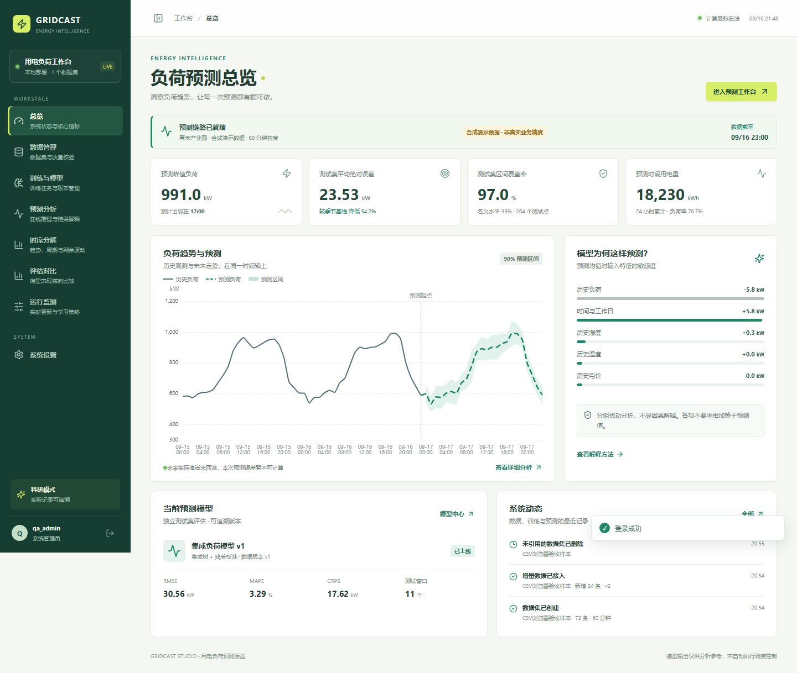
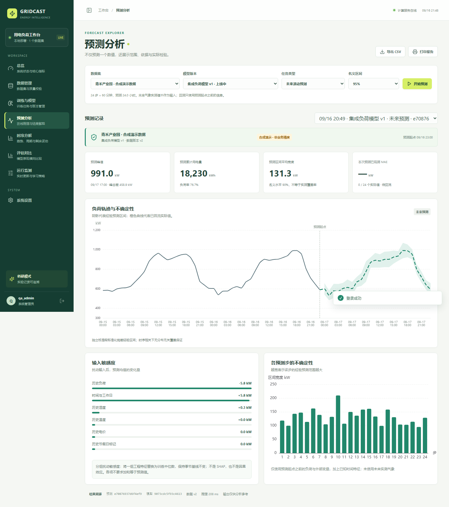

# GridCast Studio · 用电负荷预测系统

面向虚拟电厂与园区能源场景的**用电负荷预测科研原型系统**，覆盖「数据接入 → 模型训练 → 在线推理 → 可视化呈现」完整业务闭环。内置三类可真实训练的预测模型，包括基于 PyTorch 的 **SSM（选择性状态空间）+ 稀疏上下文注意力**混合架构，并通过独立校准段输出经验预测区间与不确定性估计。支持本地单机与云端容器双模式部署。

> **定位与边界**：本系统是可运行、可演示、可替换预测引擎的科研原型，不执行电网或设备调度。演示数据为合成数据，界面指标不构成真实电力业务效果证据；混合模型为研究参考实现（非官方 Mamba），不据此声称复现论文性能。真实场景精度需接入实际数据独立验证。

## 页面预览

| 总览仪表盘 | 在线预测（区间 + 解释） |
|:---:|:---:|
|  |  |

## 功能特性

| 模块 | 能力 |
|---|---|
| **数据管理** | CSV 上传（UTF-8 / GB18030）、质量校验（缺失 / 异常 / 时间连续性，不静默补造负荷）、历史曲线、增量追加与版本化、未引用删除 |
| **模型训练** | 季节朴素基线 / 集成树 / PyTorch 混合模型三类真实训练；异步任务、实时进度与日志、训练损失曲线、留出集指标（MAE / RMSE / WAPE / 覆盖率 / 区间宽度 / CRPS） |
| **在线推理** | 未来多步预测与最近留出窗口回测；80% / 90% / 95% 经验预测区间；输入敏感度解释；实际值回流后自动评估 |
| **可视化** | KPI 仪表盘（峰值 / 累计电量 / 负荷率 / 实测覆盖率）、区间面积图、多模型同窗对比、STL 时序分解、逐步区间宽度 |
| **系统与运维** | 三角色权限（管理员 / 算法工程师 / 运营）、BCrypt + JWT Cookie 会话、受控自适应重训（候选审核后人工发布）、演示数据一键生成、CSV 导出与打印报告 |
| **工程化** | 独立计算工作进程、任务队列与重启恢复、存储路径可移植（`.data` 整体拷贝即可迁移）、pytest 测试套件、ruff 全绿 |

## 架构与技术栈

```
浏览器 (Vue 3 SPA)                后端 (FastAPI, 单实例)
  ECharts 可视化       ──HTTPS──▶  Router → Service → SQLite
  哈希路由/自定义组件              独立 worker 进程（训练/推理队列）
                                  预测引擎: sklearn + PyTorch
```

- **前端**：Vue 3 · Vite · ECharts · 自定义绿色能源主题（哈希路由，资源本地化，无 CDN 依赖）
- **后端**：FastAPI · Pydantic · SQLite（WAL，零外部服务依赖）
- **模型**：scikit-learn ExtraTrees、PyTorch 选择性状态递推 + 稀疏注意力 + 门控融合（`backend/hybrid.py`）

## 快速开始

### Windows 一键启动

```powershell
.\start.cmd                    # 已有环境直接启动
.\start.cmd -Install -Hybrid   # 新机器：建虚拟环境 + 装依赖 + CPU PyTorch + 构建前端
```

启动后访问 `http://127.0.0.1:8000`。首次使用创建管理员账号（无默认密码），随后在总览页点击「初始化演示场景」即可一键体验完整流程。停止服务用 `Ctrl+C`。

### 手动安装（跨平台）

建议 Python 3.12、Node.js 22 / 24：

```bash
python3.12 -m venv .venv
source .venv/bin/activate          # Windows: .venv\Scripts\activate
pip install -r requirements.txt
pip install torch==2.8.0 --index-url https://download.pytorch.org/whl/cpu   # 混合模型需要
cd frontend && npm ci && npm run build && cd ..
python run.py
```

不用 PyTorch 混合模型时，装完 `requirements.txt` 即可运行季节基线与集成树。

### Docker

```bash
cp .env.example .env    # 设置 APP_SETUP_TOKEN 等变量后
docker compose up --build -d
```

完整步骤见[部署手册](docs/部署手册.md)。

## 推荐演示流程

1. **总览**：初始化 90 天小时级合成数据，真实训练并发布演示集成模型，生成一次回测和一次未来 24 步预测。此按钮是特例，会发布新建演示数据集的模型；正常训练不自动上线。
2. **预测分析**：选择未来预测 / 最近留出窗口回测，切换 80%、90%、95% 名义区间；查看历史、点预测、区间、实际值、输入敏感度和逐步区间宽度。未来实际值未到达时，误差显示待回流。
3. **训练与模型**：同一数据版本和预测步长训练季节基线、集成模型、SSM 混合模型。查看实际训练损失、测试指标，管理员可上线或重新发布旧版本回滚。
4. **评估对比**：只在相同数据版本、步长和测试时间窗内比较 MAE、RMSE、WAPE、覆盖率、区间宽度、区间评分和 CRPS。
5. **数据管理**：查看质量和历史曲线，上传自己的 CSV；在数据详情追加新的连续观测。演示数据可点击「追加演示数据」增加 24 小时，随后历史预测匹配到实际值。
6. **运行监测**：打开自动预测或受控重训，保存门槛。新观测达到样本数、冷却期，且误差或偏移超阈值，才生成候选模型；管理员审核再发布，不会自动替换线上模型。
7. **时序分解 / 系统设置**：查看 STL 历史分解、创建算法工程师或运营账号、修改自己的密码。

导出支持带溯源字段的 CSV；「打印报告」使用浏览器打印，可另存为 PDF。

## 数据约定

| 列 | 含义 | 要求 |
|---|---|---|
| `timestamp` | 采样时刻 | 必填，推荐 `2026-01-01 00:00:00` |
| `load` | 用电功率，kW | 必填，有限非负数，非累计电表读数 |
| `temperature` | 温度，℃ | 可选 |
| `humidity` | 湿度，% | 可选 |
| `price` | 电价 | 可选，保持统一计价单位 |
| `is_holiday` | 节假日标记 | 可选，建议 0 / 1 |

- CSV 支持 UTF-8 / GB18030，单文件最大 20 MB，单数据集最大 100,000 行；两行格式模板可在数据页下载。
- 固定采样间隔 5 分钟至 1 天，必须整除 1,440 分钟。缺失时点、缺失负荷、负值不静默补造；重复时点保留最后一条并提示；统计异常保留供核查。
- 无时区时间按北京时间解释；带一致时区的数据转成 Asia/Shanghai；不能混合带时区和不带时区。
- 可选字段构造特征时前向填充，起始缺失用仅从训练段计算的中位数；未来实测气象不会泄露进预测。
- 追加必须从当前末尾的下一采样时刻开始、至少 2 条，不覆盖历史；每次生成新的不可变 CSV 版本，历史模型保留原训练快照。
- 预测步数不是小时数：15 分钟粒度的 96 步才是 24 小时。支持 2–168 步，7 天预测仅在小时级或更粗粒度满足。模型训练后窗口固定，推理沿用该窗口。
- 数据过少会明确失败，建议至少 `max(20 × 预测步数, 4 × 历史窗口长度)` 行；小时级 24 步实验建议 30–90 天。

## 模型与评估

**三类可运行模型**

- **季节朴素基线**：重复最近一个日周期，供对照。
- **集成树 + 残差校准**：64 棵 ExtraTrees 对多步季节残差建模，使用历史负荷、日历和可选历史外部变量；独立校准段修正区间尺度。
- **SSM + 稀疏上下文注意力**：真实 PyTorch 选择性状态递推、稀疏上下文注意力、门控融合、残差、归一化和 Dropout；AdamW 训练并保留验证最优权重，推理执行 24 次 MC Dropout 估计离散程度。

**评估口径**：按原始时间序列 60% / 15% / 12.5% / 12.5% 划分训练、验证、校准、测试；后两段目标窗口互不重叠，预处理统计量只来自训练段，测试标签不用于拟合或区间校准。长数据最多抽取 2,500 个训练窗口以限制原型计算量。

**必须了解的边界**：区间是独立校准残差得到的**经验预测区间**，不是参数置信区间，名义 95% 不等于实测覆盖 95%。CRPS 为 48 次校准残差抽样的近似值。解释采用分组输入扰动 / 通道遮蔽，不是 SHAP、不是因果解释。STL 用于事后探索，不作为未来已知特征。系统保存真实指标，不显示伪造的准确率；实际精度取决于场景、数据质量、时间跨度和模型配置。

## 部署

支持**本地单机**（默认仅绑定 `127.0.0.1:8000`）与**云端单实例容器**（多阶段镜像、非 root、持久命名卷）两种模式，同一套程序与配置体系，配置全部走环境变量。

完整步骤（Docker Compose 与裸机 systemd + Nginx、HTTPS、备份恢复、故障排查、上线检查清单）见 **[docs/部署手册.md](docs/部署手册.md)**。交付他人可运行 `python scripts/make_release.py` 生成含预构建前端与 SHA256 校验的干净 zip。

> 注意：仅允许运行**一个 API 实例 + 一个计算 worker**，不支持多副本负载均衡；本仓库作者环境未安装 Docker，容器配置已提供但未实际构建验证。

## 安全与数据

- **权限**：管理员全功能；工程师可导入 / 追加数据、训练和预测；运营可查看、预测和导出。密码 BCrypt 存储，JWT 保存为 HttpOnly / SameSite Cookie（8 小时），云端初始化要求 `APP_SETUP_TOKEN`（≥16 位）。
- **存储**：`.data` 包含 SQLite 数据库、版本化 CSV、模型文件、签名密钥与日志，不应公开或提交版本库。数据库中的文件路径为相对路径，**`.data` 整体拷贝即可跨机器 / 跨容器迁移**；旧版本绝对路径启动时自动迁移。
- **备份恢复**：停止应用后整体复制 `.data`；恢复时整体放回并启动。公网部署务必启用 HTTPS 并设置 `APP_COOKIE_SECURE=true`。
- **重启行为**：排队任务保留，运行中任务标记失败可重新提交；已保存模型、预测和用户仍在。模型文件由内部训练生成，不要加载来源不可信的模型文件。

## 开发与测试

```bash
pip install -r requirements-dev.txt
pytest                                    # 全部 23 个用例（集成含真实训练，约 1-2 分钟）
pytest -m "not integration"               # 快速单元检查
ruff check backend run.py scripts tests   # 代码规范
```

前端独立开发：先启动后端，再在 `frontend` 执行 `npm run dev`（Vite 代理 `/api` 到本机 8000）；修改界面后 `start.cmd -Rebuild` 重新构建。

## 工程结构

```text
backend/main.py       HTTP API、鉴权入口、静态资源
backend/datasets.py   CSV 校验、版本与增量数据
backend/engine.py     特征、训练、校准、评估与预测
backend/hybrid.py     PyTorch 混合参考模型
backend/service.py    发布、监测与自适应策略
backend/worker.py     独立异步任务工作进程
backend/store.py      SQLite 存储与路径可移植化
backend/security.py   用户权限与会话
frontend/src/pages/   总览、数据、模型、预测、对比、分解、监测、设置
deploy/               systemd 服务与 Nginx HTTPS 反代示例
scripts/              交付打包脚本 make_release.py
tests/                pytest 测试套件
docs/                 需求覆盖、部署手册、验收记录与截图
```

实际接口以运行实例 `/docs` 的 OpenAPI 为准；采用 HTTP 状态码与原生 JSON，未使用 `{code,message,data}` 包装。

## 后续工作

优先级从高到低：接入真实业务数据完成科研验证 → 适配已验证的正式模型与权重（保持数据契约与可视化，替换 `engine` 训练 / 推理接口）→ 数据源连接器、分页缓存、GPU 与生产级运维 → 由项目方确定验收口径。专利、论文、实际部署与经济效益不由本原型代替验证。

## 文档

- [需求覆盖与阶段规划](docs/需求覆盖与阶段规划.md) —— 功能清单与合同模块的映射、工程决定、后续阶段
- [部署手册](docs/部署手册.md) —— 服务器部署完整步骤
- [验收记录](docs/验收记录.md) —— 已执行的全部验证与边界
- 原始《用电量预测原型系统需求分析》随交付 zip 提供
